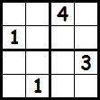

title: Programming in a Logical World
author:
  name: Jordan Scales
  twitter: jdan
  url: http://jordanscales.com
output: index.html
style: prolog-style.css
controls: false

--

# PROLOG
## Programming in a Logical World

--

### What we're used to

Most modern programming languages involve changing the program's *state* or
general *control flow*.

```javascript
if (x == 'hello') {
  console.log('Hello!');
} else {
  console.log('Goodbye!');
}
```

We express *how* a program should accomplish a given task.

--

### What is Logic Programming?

Logic programming, instead, is *constraint-based*.

We define *facts* and *rules*, then query our knowledge base to get a result.

```prolog
coder(jordan).
coder(ryan).

?- coder(X).
X = jordan ;
X = ryan
```

This is also known as *declarative programming*.

--

### Facts and Rules

*Facts* are simple truths. Water is wet. Fire is hot.

```prolog
hot(fire).
wet(water).
```

Facts also have *arity*.

```prolog
age(jordan, 21).
dob(jordan, 7, 20, 1992).
```

Notice these elements have no real type, only *arity*. These also do not
*return* anything, they are true!

--

### Facts and Rules

*Rules* allow you to define truths using *logical inference*. They are declared
in the form of:

```prolog
Head :- Body
```

which states "The Head is true if Body is true." For instance, let's say a
*junior coder* is a coder who is 21 years old.

```prolog
junior_coder(X) :- coder(X), age(X, 21).
```

--

### Facts and Rules

```prolog
price(purse, 200).
price(shoes, 75).
price(candy, 2).
price(car, 20000).

expensive(Item) :- price(Item, N), N > 50.
```

Here we are saying an item is *expensive* if its price is greater than 50. We
can then query our data set:

```prolog
?- expensive(X).
X = purse ;
X = shoes ;
X = car.
```

--

### Types in Prolog

**atom**: No real meaning, usually lowercase. (jordan, 'example')

**number**: Floats an integers.

**variable**: Strings of letters, numbers, and underscores beginning with an
uppercase letter or underscore. *Very similar to logic notation - placeholders*.

**compound term**: A *functor* with a list of arguments. Used to represent
collections of data.

--

### Types in Prolog

**RECAP**

Lowercase strings, such as `jordan`, or `water`, are known as atoms which hold
no value other than their name.

Uppercase strings are known as variables. Prolog uses a process called
*unification* to assign values (atoms or numbers) to these variables in order
to make your statements correct.

--

### Pattern Matching

Prolog statements can contain patterns that are matched (or *unified*) to a
given input. Consider a rule `same(A, B)` which is true if A and B are equal.

```prolog
same(A, B) :- A is B.

?- same(14, 14).
true.

?- same(14, 13).
false.
```

We can do better.

--

### Pattern Matching

```prolog
same(A, B) :- A is B.

... VS ...

same(A, A).
```

If prolog fails to *unify* a given input to our statements, it will return
false. `same(13, 14)` will *not match*, but `same(5, 5)` will.

*Note*: All items will match to "_", which acts as a wildcard.

--

### Matching on Lists

Lists in prolog are represented in the form of `[Head|Tail]`.

They can be rewritten using *syntactic sugar* in the form of `[1, 2, 3, etc]`.

We can implement pattern matching using the list's true form.

```prolog
starts_with_5([Head|Tail]) :- Head is 5.
```

--

### Matching on Lists

```prolog
starts_with_5([Head|Tail]) :- Head is 5.

?- starts_with_5([1,2,3]).
false.

?- starts_with_5([5,6,7]).
true.

?- starts_with_5([X,6,7]).
X = 5.
```

--

### Putting it Together

Let's define a rule `all_equal/2` which is true if all elements in a list L
are equal to N. We'll use *pattern matching* to accomplish this.

```prolog
all_equal([], _).
all_equal([N|T], N) :- all_equal(T, N).
```

* All elements in an empty list are equal to N.
* All elements in a list are equal to N if the first element is N and the
remaining elements are all equal to N.

--

### Unification

Prolog uses a process called *unification* to solve problems.

Rather than returning values, like many modern programming languages, queries
will search your data intelligently in order to satisfy the conditions you have
specified.

We did not tell our program to loop through our items, we simply *clearly*
defined what it means to be expensive, and Prolog did the rest.

--

### What's Prolog good for?

Prolog shines when you are given a problem with clear *constraints*. Some
examples include:

* Scheduling
* Language Processing
* Artificial Intelligence

It's also fun to use when solving logic puzzles such as the Eight Queens
problem or grid puzzles. Let's take a stab at *Sudoku*.

--

### Sudoku

Let's try to solve the following Sudoku puzzle.



First, let's form a notation to locate each individual cell. We'll say CXY
points to the Yth cell in the Xth column. (C13 = 4).

--

### Sudoku


What are our constraints? Remember, be *explicit*.

* All cells must have a value between 1 and 4 inclusive.
* All cells in a given row must be different.
* All cells in a given column must be different.
* All cells in an outlined 2x2 box must be different.

--

### `all_between/3`

Let's write a rule to determine if a given list L is composed of elements which
are all between A and B.

```prolog
all_between(_, _, []).
all_between(A, B, [H|T]) :-
    between(A, B, H), all_between(A, B, T).
```

* All elements of an empty list are between A and B.
* All elements of a list are between A and B if the first element is between
A and B and all remaining elements are between A and B.

--

### `all_different/1`

We need to determine if a list has no duplicate elements. We'll make use of
`not/1`, `member/2`, and pattern matching to accomplish this.

```prolog
all_different([]).
all_different([H|T]) :- not(member(H, T)), all_different(T).
```

* All elements of an empty list are different.
* All elements of a list are different if the first element is not one of the
remaining elements, and the remaining elements are all different.

--

### Putting it Together

Using our rules from before, let's solve a 4x4 sudoku puzzle. We'll represent
a puzzle as a list of items `[C11, C12, ..., C43, C44]`.

```prolog
sudoku([C11, C12, C13, C14,
        C21, C22, C23, C24,
        C31, C32, C33, C34,
        C41, C42, C43, C44]) :-

  all_between(1, 4, [C11, C12, C13, C14,
                     C21, C22, C23, C24,
                     C31, C32, C33, C34,
                     C41, C42, C43, C44]),
  all_different([C11, C12, C13, C14]), ...
```

--

### Putting it Together

```prolog
...
all_different([C21, C22, C23, C24]),
all_different([C31, C32, C33, C34]),
all_different([C41, C42, C43, C44]),

all_different([C11, C21, C31, C41]),
all_different([C12, C22, C32, C42]),
all_different([C13, C23, C33, C43]),
all_different([C14, C24, C34, C44]),

all_different([C11, C12, C21, C22]),
all_different([C13, C14, C23, C24]),
all_different([C31, C32, C41, C42]),
all_different([C33, C34, C43, C44]).
```

\*exhale\*

--

### Solving a Sudoku Puzzle

23 lines later, we have a 4x4 Sudoku solver. Not bad!


```prolog
?- sudoku([C11, C12, 4, C14,
           1, C22, C23, C24,
           C31, C32, C33, 3,
           C41, 1, C43, C44]).
C11 = C24, C24 = C32, C32 = C43, C43 = 2,
C12 = C23, C23 = C41, C41 = 3,
C14 = C33, C33 = 1,
C22 = C31, C31 = C44, C44 = 4 .
```

--

### Solving a Sudoku Puzzle


Prolog suggests the following solution:

```
2 3 4 1
1 4 3 2
4 2 1 3
3 1 2 4
```

Which looks good!

--

### More Info

My examples use SWI-Prolog (http://www.swi-prolog.org/).

Check out the [Wikipedia article](http://en.wikipedia.org/wiki/Prolog) on
Prolog for more details on its history and inner-workings.

[Learn Prolog Now!](http://www.learnprolognow.org/) is also a fantastic
learning resource.

I also can't recommend [99 Prolog Problems](https://sites.google.com/site/prologsite/prolog-problems) enough.

--

# Questions?
## `question(X) :- mentioned(X), not(explained(X)).`
